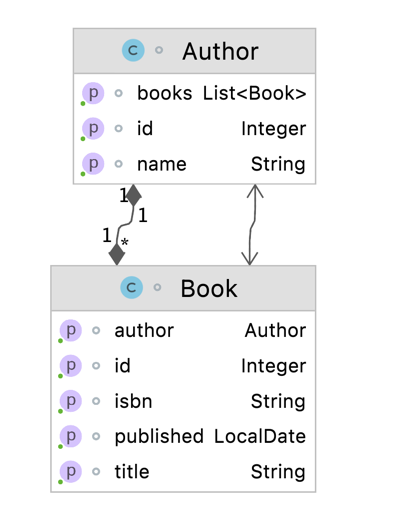

## Project
This project is based on [Hibernate reactive](https://github.com/hibernate/hibernate-reactive)

### Why?
To show and review how hibernate implements reactive programming.

### Assumptions
1. PostgreSQL instance

### Pre-requisites
1. Create the user and password for this project following the script below
```sql
CREATE ROLE "16bits_user" WITH
LOGIN
NOSUPERUSER
CREATEDB
CREATEROLE
INHERIT
NOREPLICATION
CONNECTION LIMIT -1
PASSWORD 'xxxxxx';
COMMENT ON ROLE "16bits_user" IS 'User to test the hibernate reactive';
```

# How to run
1. Start the database instance, if you're using Brew use the following command:

```bash
brew services start postgres
```

2. Native SQL
```none
Run the CompletionStageExample program
```
3. Session

```none
Run the MutinyExample program
```

4. To stop, use the following command:
```bash
brew services stop postgres
```

# Class diagram
<kbd>
    
</kbd>

# Tech stack
- openjdk-11
- maven 3.6.3
- postgresql 13.4
- hibernate-reactive 1.1.0.Final
- tests (not available right now) :cry:

### References
1. [Hibernate](https://hibernate.org/orm/tooling/)
2. [MetamodelGenerator](https://docs.jboss.org/hibernate/orm/5.6/topical/html_single/metamodelgen/MetamodelGenerator.html)
3. [Reactive programming and relational databases](https://in.relation.to/2020/12/03/hibernate-reactive/)
4. [Hibernate API](https://hibernate.org/reactive/documentation/1.0/reference/html_single/)
5. [Smallrye Completion Stages](https://smallrye.io/smallrye-mutiny/guides/completion-stages)
6. [Mutiny Concepts & Philosophy](https://smallrye.io/smallrye-mutiny/pages/philosophy)
7. [Stage or Mutiny](https://hibernate.org/reactive/documentation/1.0/reference/html_single/#_apis_for_chaining_reactive_operations)
8. [You Don’t Need Hibernate With Spring WebFlux and R2DBC](https://dzone.com/articles/you-dont-need-hibernate-with-spring-webflux-and-r2)
9. [R2DBC](https://r2dbc.io)